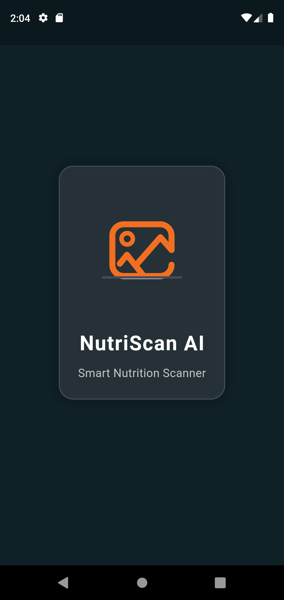
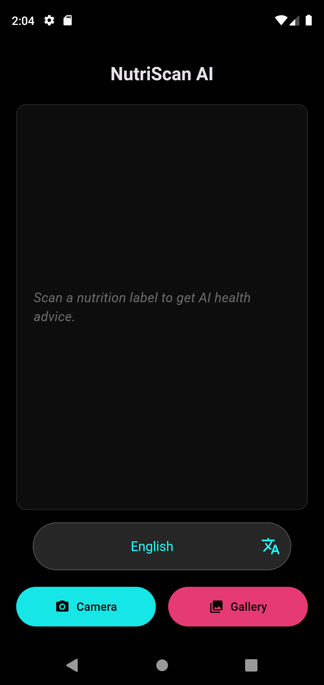
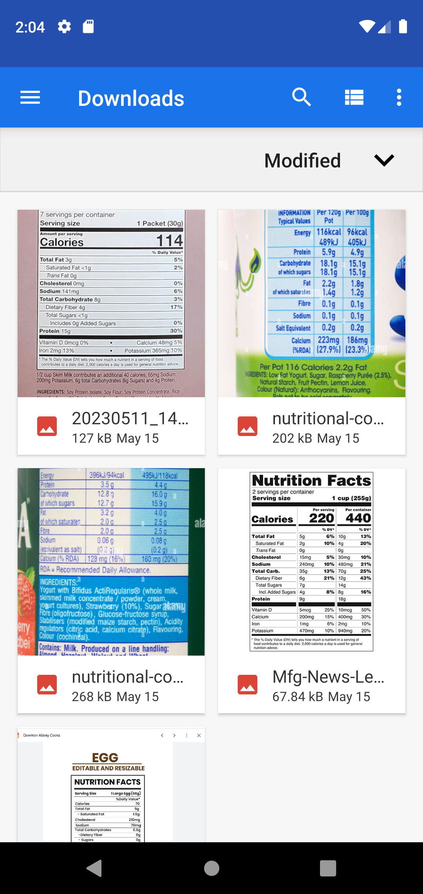
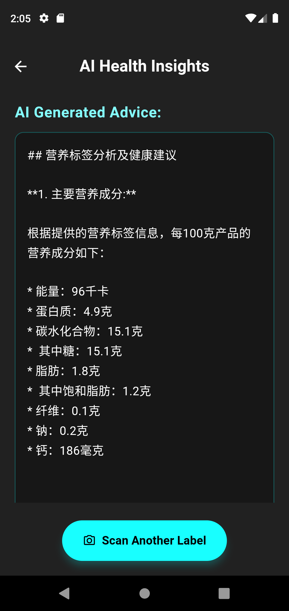

# NutriScan AI 

 
 
 
 
 

NutriScan AI is a Flutter-based mobile application designed to help users understand the nutritional content of food products quickly and easily. By simply taking a photo of a nutrition label or selecting an image from their gallery, users can get AI-powered health advice and insights in their preferred language.

## ✨ Features

*   **📷 Image-to-Text (OCR):** Scan nutrition labels using your device's camera or pick an image from the gallery.
*   **🔍 Smart Label Detection:** Intelligently identifies if the scanned image contains relevant nutritional information.
*   **🤖 AI-Powered Health Advice:** Get personalized health advice and analysis based on the extracted nutritional data.
*   **🌐 Multi-Language Support:** Receive AI advice in various languages including English, Spanish, French, German, Hindi, Arabic, Chinese (Simplified), Japanese, Korean, Portuguese, and Russian.
*   **📱 User-Friendly Interface:** Clean, intuitive, and responsive design for a seamless user experience.
*   **📊 Results Display:** Clearly presents the AI-generated health advice.

## 🚀 Technologies Used

*   **Flutter:** For cross-platform mobile application development.
*   **Dart:** Programming language for Flutter.
*   **Image Picker (`image_picker`):** To select images from the gallery or capture photos using the camera.
*   **Google ML Kit Text Recognition (`google_mlkit_text_recognition`):** For extracting text from images (OCR).
*   **Nutrition AI Analyzer Service:** (Assumed) A backend service or model that processes OCR text and provides health advice.

## 📖 How to Use

1.  Launch the NutriScan AI app.
2.  Select your preferred language for receiving health advice from the dropdown menu.
3.  Tap the **"Camera"** button to take a new photo of a nutrition label or tap the **"Gallery"** button to choose an existing image.
4.  The app will process the image and extract the text.
5.  If a nutrition label is detected, the app will send the text to the AI analyzer.
6.  View the AI-generated health advice on the results screen.
7.  If the image doesn't seem to contain nutrition information, a message will prompt you to try again.

## 🔮 Future Improvements

*   Barcode scanning for quick product identification.
*   History of scanned items.
*   User accounts for personalized tracking and advice.
*   Detailed breakdown of nutrients beyond AI advice.
*   Integration with health and fitness apps.

## 📄 License

This project is licensed under the MIT License - see the [LICENSE.md](LICENSE.md) file for details (though you'll need to create this file if you want a specific license). If no `LICENSE.md` is present, it defaults to standard copyright.

---

_Replace `YOUR_USERNAME` in the clone URL with your actual GitHub username._
_Consider creating a `LICENSE.md` file (e.g., with the MIT License text) if you want to explicitly define the license._
